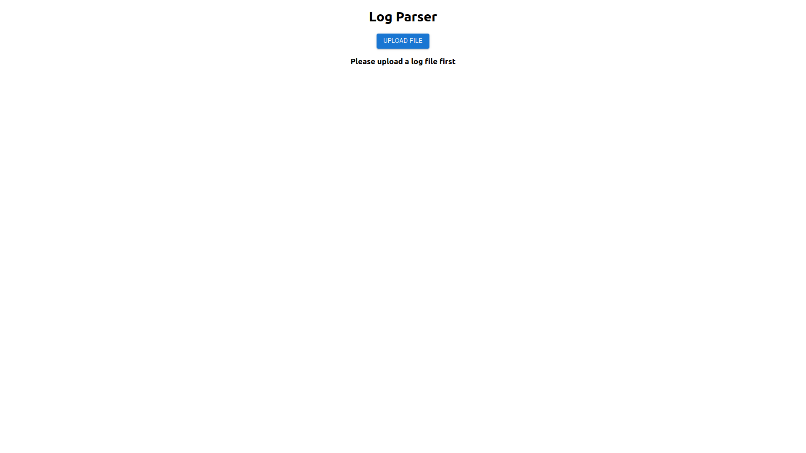

# Log Parser Frontend

Frontend ReactJS application to upload logfile to [Log Parser Backend](https://github.com/hemanth-kumarv/log-parser-backend) and view the formatted tabular version of the log file. Made using MaterialUI. Loading indicators when uploading and Error modal/popup for errors displayed.

## Features

- Material UI
- Loading indicator and Error modal
- Save/download data as text file

## Demo

Here is a working live demo : https://github.com/hemanth-kumarv/log-parser-frontend

### Landing Page

### Table View

### Error Modal

## Setup

Clone this repo to your desktop and run `npm install` to install all the dependencies.
Once the dependencies are installed, you need to run `npm run start` to run the webapp. You might want to look into `package.json` to change the port.

For the backend, you need to clone the backend repository https://github.com/hemanth-kumarv/log-parser-backend, follow the setup and start the backend locally.

## Usage

Once the dependencies are installed and dist is created, you need to run `npm run start` to start the server.
You will then be able to access it at `localhost:3001`

## To-do

- Better error handling
- Unit testing
- Enhanced UI/UX
- More functionalities/features
